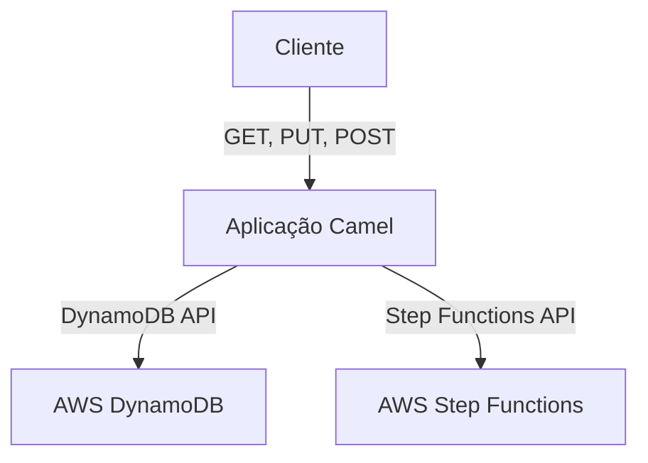

# Aplicação Camel - Integração com DynamoDB e Step Functions

Este projeto implementa uma solução baseada em **Apache Camel**, **AWS DynamoDB** e **AWS Step Functions**, permitindo o gerenciamento de tasks através de um padrão baseado em callback (`taskToken`).

## **Visão Geral**

A aplicação Camel expõe **três endpoints REST**:

1. **GET /tasks**: Recupera tasks do **DynamoDB** filtradas por status.
2. **PUT /tasks**: Cria uma nova task no **DynamoDB**.
3. **POST /tasks/decision**: Envia uma decisão para o **Step Functions** via `taskToken` e atualiza o status no **DynamoDB**.

## **Arquitetura da Solução**



### **Componentes**

1. **Apache Camel**:

    - Responsável pelo roteamento e processamento de mensagens REST.
    - Interage com o **DynamoDB** e **Step Functions**.

2. **DynamoDB**:

    - Banco de dados NoSQL onde as tasks são armazenadas e gerenciadas.

3. **AWS Step Functions**:

    - Executa fluxos de trabalho baseados em `taskToken`.
    - Aguarda uma resposta da API via `SendTaskSuccess` ou `SendTaskFailure`.

---

## **Endpoints**

### **GET /tasks**

**Descrição:** Retorna as tasks filtradas por status.

**Query Parameters:**

- `status` (string) - Status desejado (`PENDING`, `APPROVED`, `REJECTED`).

**Exemplo de Chamada:**

```http
GET /tasks?status=PENDING
```

**Exemplo de Resposta:**

```json
[
  {
    "businessKey": "BK12345",
    "executionStartTime": "2025-02-26T10:00:00Z",
    "executionId": "exec-001",
    "taskToken": "abcd1234",
    "status": "PENDING"
  }
]
```

---

### **PUT /tasks**

**Descrição:** Cria uma nova task no **DynamoDB**.

**Body:**

```json
{
  "businessKey": "BK12345",
  "executionStartTime": "2025-02-26T10:00:00Z",
  "executionId": "exec-001",
  "taskToken": "abcd1234",
  "status": "PENDING"
}
```

**Exemplo de Chamada:**

```http
PUT /tasks
```

**Exemplo de Resposta:**

```json
{
  "message": "Task criada com sucesso."
}
```

---

### **POST /tasks/decision**

**Descrição:** Atualiza o status de uma task e envia a decisão ao **Step Functions**.

**Body:**

```json
{
  "taskToken": "abcd1234",
  "decision": "APPROVED"
}
```

**Exemplo de Chamada:**

```http
POST /tasks/decision
```

**Exemplo de Resposta:**

```json
{
  "message": "Decisão aplicada com sucesso.",
  "status": "APPROVED"
}
```

---

## **Contrato OpenAPI 3**

```yaml
openapi: 3.0.3
info:
  title: Aplicação Camel - Integração DynamoDB/StepFunctions
  version: 1.0.0
servers:
  - url: http://localhost:8080
    description: Servidor local

paths:
  /tasks:
    get:
      summary: Recuperar tasks filtradas pelo status
      parameters:
        - in: query
          name: status
          required: true
          schema:
            type: string
      responses:
        '200':
          description: Lista de tasks retornada com sucesso.
          content:
            application/json:
              schema:
                type: array
                items:
                  $ref: '#/components/schemas/Task'

    put:
      summary: Criar um novo registro de task
      requestBody:
        required: true
        content:
          application/json:
            schema:
              $ref: '#/components/schemas/Task'
      responses:
        '201':
          description: Task criada com sucesso.

  /tasks/decision:
    post:
      summary: Decidir uma task e notificar o Step Functions
      requestBody:
        required: true
        content:
          application/json:
            schema:
              type: object
              properties:
                taskToken:
                  type: string
                decision:
                  type: string
                  enum: [APPROVED, REJECTED]
      responses:
        '200':
          description: Decisão aplicada com sucesso.

components:
  schemas:
    Task:
      type: object
      properties:
        businessKey:
          type: string
        executionStartTime:
          type: string
          format: date-time
        executionId:
          type: string
        taskToken:
          type: string
        status:
          type: string
```

---

## **Considerações Finais**

- **Validação**: O `status` deve ser validado antes de salvar no **DynamoDB**.
- **Erros**: Diferencie erros de validação (`400`) de erros internos (`500`).
- **Segurança**: Recomenda-se autenticação via **JWT**, **OAuth**, ou **IAM Roles**.
- **Escalabilidade**: Utilize **DynamoDB Auto Scaling** e configure corretamente as chaves de partição para evitar *hot partitions*.

---

